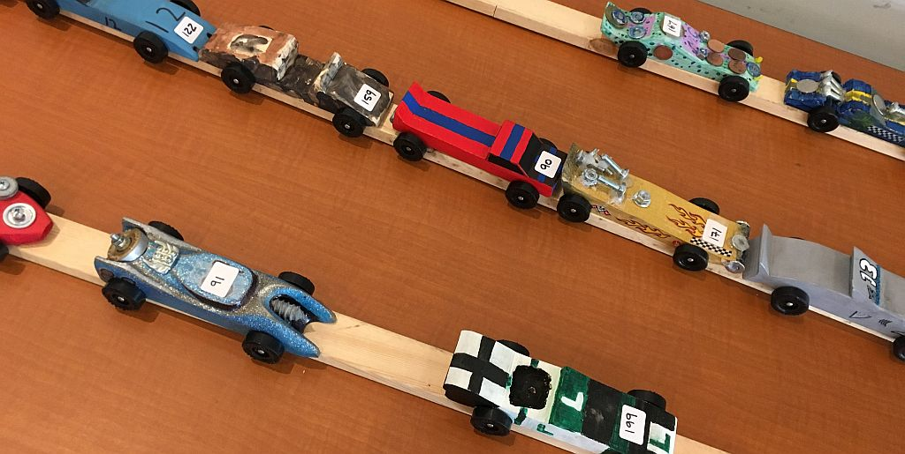

## Kub Kar Races

Kub Kar races are a central event at <b>Funarama 2020 - The Mystery at Funarama</b>; youth will race their Kub Kars throughout the day on Saturday, and then the finals and off-spec demonstration races will take place on Sunday.

<b>All Cubs must bring their own Kub Kars to camp; there will not be an opportunity to construct Kars during the weekend.</b>

## Kub Kar Specifications
Kub Kars must meet -- not exceed! -- the following size and weight limitations in order to take part in the Kub Kar Rally at <b>Funarama 2020 - The Mystery at Funarama</b>:

<ul>
<li>Overall length shall not be more than 7 inches or 177.8 millimetres.</li>
<li>Overall Width shall not exceed 2 ¾ inches or 69.85 millimetres.</li>
<li>Overall height shall not exceed 3 1/8 inches or 79.375 millimetres.</li>
<li>Total weight shall not exceed 5 ounces or 141.75 grams.</li>
<li>Kar chassis shall clear the track by no less than 3/8 inches or 9.525 millimetres.</li>
<li>Kar chassis at front shall clear the track by no more than 5/8 inches or 15.875 millimetres.</li>
<li>Inside width between wheels shall not be less than 1 ¾ inches or 44.45 millimetres.</li>
</ul>

Kars which do not meet these specifications will -- to the limits of the abilities and tools of the on-site pit crew -- be modified to meet them. However, Cub Scouts do have the option to leave their Kars unmodified, and to build Kars which wildly exceed the above limitations; these Kars cannot take part in the normal races, but there will be an exhibition race for off-spec Kars on Sunday, February 9th, 2020.

## Kub Kar Rules
In addition to meeting the above size and weight requirements, there are additional rules which all Kub Kars must follow in order to take part in the Kub Kar Rally at <b>Funarama 2020 - The Mystery at Funarama</b>:

<ul>
<li>Only powdered graphite lubricant shall be used on the wheel wells of Kub Kars.</li>
<li>No loose material of any kind is permitted on the Kar. The Kar may be hollowed out and built up to a maximum weight by the addition of other materials provided that these are securely affixed to the body of the Kar.</li>
<li>Wheels shall not be altered except for light sanding to remove burrs, etc.</li>
<li>Wheel bearings, washers, and bushings are prohibited in conjunction with the running gear.</li>
<li>The Kar shall not ride on, or otherwise incorporate, any kind of spring.</li>
<li>Details such as steering wheels, drivers, decals, paint, interior components, and suchlike are permitted, as long as the Kar still conforms to the above weight and size limitations, and provided that all details are firmly affixed to the body of the Kar.</li>
<li>The Kar must be free wheeling with no starting devices.</li>
<li>The Kar shall be raced in the forward-facing direction only. The front of the Kar shall be determined at registration.</li>
<li>The Kar must not be of a manufactured type (e.g. from a model kit).</li>
<li>The Kar must be built in the current racing year.</li>
<li>Once a Kar is registered for the Kub Kar Rally, it shall not be modified.</li>
<li>Once a Kar is registered for the Kub Kar Rally, it shall not be returned to its owner until the owner leaves the event, or until the Kub Kar Rally is concluded.</li>
<li>A Kar shall only participate in the Kub Kar Rally as long as its owner is present at Funarama; if a Cub Scout must leave early, their Kar shall be removed from the Rally when they leave.</li>
</ul> 